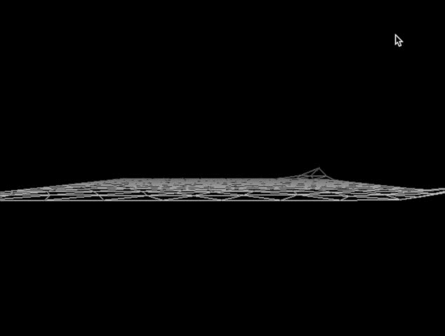
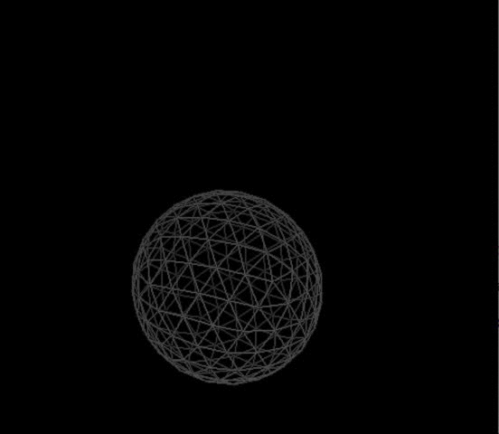

#Meshed Mass Spring

###Prompt 1 - Meshed Mass Spring

Tian Lan, Xide Xia

================

In our project, we used the Mesh class to implement the mass-spring model. By using a triangular Mesh instead, we implemented forces applied to the surfaces (triangles) of the mesh. We are able to add the wind force and the air pressure force. The wind force applies to all mesh objects. It would drive a boat to sail, cause waves in the shallow water models, and blow away balls in desired directions. The air pressure applies to all convex enclosed meshes. It could fill a ball with air, and make the ball stable during collision. So you could bounce the ball on a wall, against the surface of water, and even have two balls that collide with each other.

###Sample

Take a look at meshed_mass_spring.cpp for a cool piece of sample code. We use the wind force, the air pressure force, and all forces in the old mass spring. You can find that the code for the old forces does not change at all.

###Using the code

Our code design is very easy to use, and it will be compatible with your old mass spring code if you change your graph to a mesh.

Before you start, check if your mesh supports the following interface:

```
//Iterator that iterates through all nodes of the mesh:
Mesh::node_begin();
Mesh::node_end();
//Iterator that iterates through all triangles of the mesh
Mesh::triangle_begin();
Mesh::triangle_end();
Mesh::node_type::degree();  // The number of incident edges
Mesh::edge_type::length();  //The length of an edge 
//Incident Iterator that iterates through the incident edges of a node
Mesh::node_type::edge_begin();
Mesh::node_type::edge_end(); 
//Incident Iterator that iterates through the incident triangles of a node
Mesh::node_type::triangle_begin();
Mesh::node_type::triangle_end();
```

Then, make sure that all of your forces provide the following interface.
```
Point F(NODE n, double t)
```
All you need is to use Meshed_mass_spring.hpp. You may use our CombinedForce to make it easy to add many forces.

In your main function, use the following code to initialize WindForce.
```
WindForce wind_force(Point(x,y,z));
```
The direction of the wind is specified by (x, y, z)
 
In your main function, use the following code to initialize PressureForce.
```
PressureForce<NodeType, MeshType> pressure_force(p_out, C, &mesh)
``` 
p_out specifies the air pressure outside the ball. C specifies the amount of air you put into the ball.

After adding the force, template the mesh on the TriData, NodeData, and EdgeData we provide in meshed_mass_spring.cpp. You can add new members, but DO NOT delete any members.

###Trouble shooting

1. The mesh explodes when it collides.  
  Our code requires that the ball remains a convex shape. If there is very little air inside the ball (C is very small), the ball can become concave during collision. Try increase C.

2. The mesh explodes at the beginning.  
  When K is large and dt is large, the mesh may be unstable. Try decrease dt.  
  It is also possible that you forget to include the spring force. In that case, the ball will expand without constraint.

3. The ball is always shaking.  
As there is difference in air pressure inside and outside the ball at the begging, the volume of the ball will fluctuates due to the effect of spring force and air pressure. This is a physical phenomenon instead of a bug. If you do not like it, try increasing K. Also, you can try setting the L in spring force to be smaller than the length of edges.

4. It just does not work.  
Contact us. Tian Lan tianlan@g.harvard.edu  Xide Xia xidexia@g.harvard.edu

###Demo

####1. WindForce  


####2. inflatable ball    


####3. Bouncing Ball  


####3. A ball in a corner with wind  
